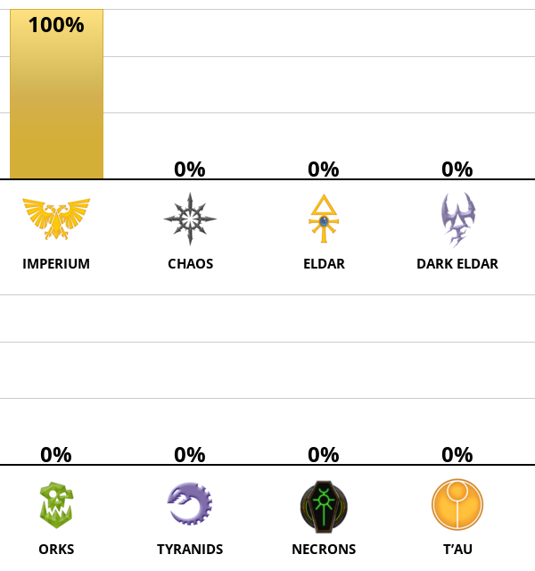
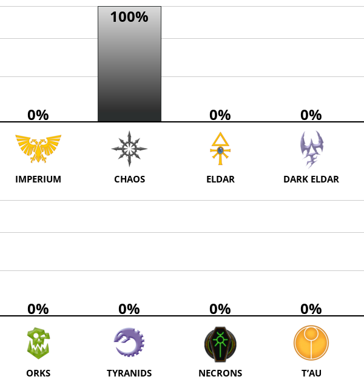
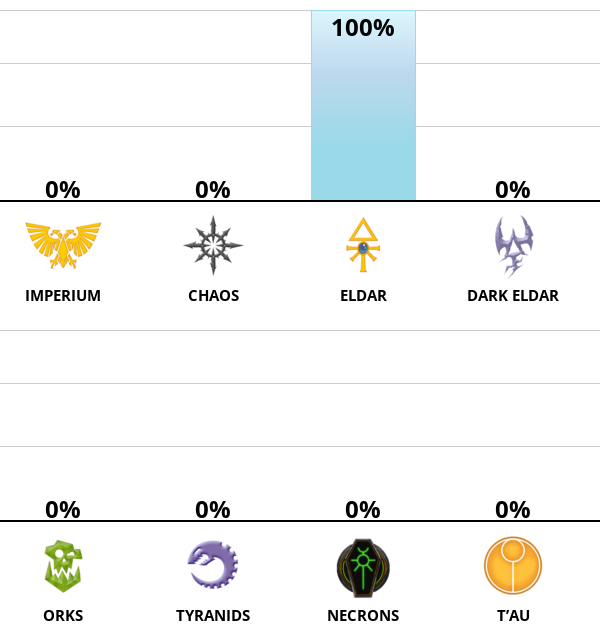
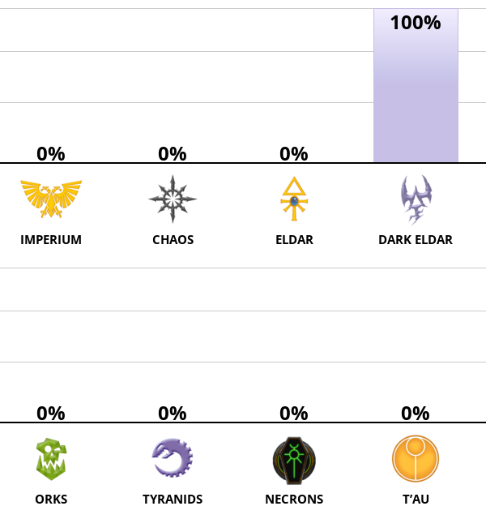
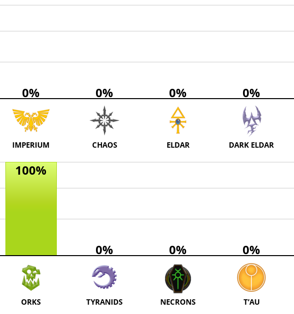
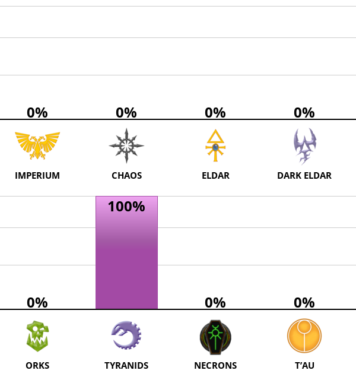
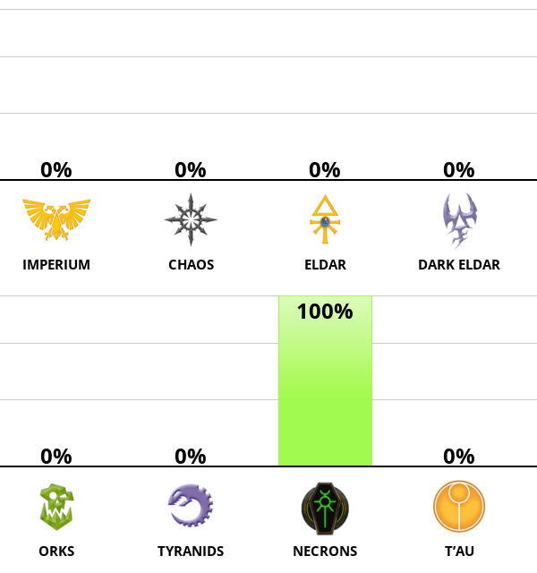
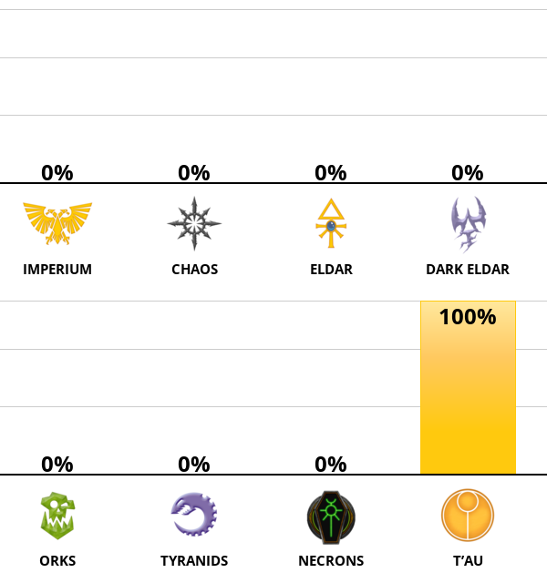

# Warhammer 40k Factions Test — reverse-engineered weights

Unofficial analysis of the [IDRlabs Warhammer 40k Factions Test](https://www.idrlabs.com/warhammer-40k-factions/test.php).

**Not affiliated with Games Workshop or IDRlabs.** Warhammer 40,000 and all related names are trademarks of Games Workshop Group PLC.

## What we found

- **40 questions**, each mapped to **exactly one** faction
- **8 factions × 5 questions** each
- Slider scale: `0` Disagree … `2` Neutral … `4` Agree (shown below as answers **1–5**)
- All-neutral baseline → every faction **50%**
- Full Agree (or reverse Disagree) on an item → **±10 percentage points** on that faction
- Final score ≈ `50 + sum of deltas` for the faction (range ~0–100%)

| Faction | Question IDs | Notes |
|---|---|---|
| Imperium of Man | 1–5 | |
| Chaos | 6–10 | |
| Eldar | 11–15 | Q14–15 are **reverse** |
| Dark Eldar | 16–20 | |
| Orks | 21–25 | |
| Tyranids | 26–30 | |
| Necrons | 31–35 | |
| T’au Empire | 36–40 | |

Full per-answer table: [`out/scoring_table.csv`](out/scoring_table.csv)

---

## How to get **100%** for a faction (everyone else **0%**)

General recipe:

1. **Agree (5)** on all **normal** items of your target faction  
2. **Disagree (1)** on that faction’s **reverse** items (only Eldar Q14–15)  
3. **Disagree (1)** on every other faction’s normal items  
4. **Agree (5)** on foreign **reverse** items (Q14–15 when you are *not* aiming for Eldar) — otherwise Eldar stays at 40%

> Questions are **shuffled** in the UI. Match by question text / id, not by “Question N of 40”.

### Quick cheat sheet

| Target | Agree (5) on | Disagree (1) on | Chart |
|---|---|---|---|
| Imperium of Man | Q1–5 + Q14–15 | everything else | `p=100,0,0,0,0,0,0,0` |
| Chaos | Q6–10 + Q14–15 | everything else | `p=0,100,0,0,0,0,0,0` |
| Eldar | Q11–13 | everything else (incl. reverse Q14–15) | `p=0,0,100,0,0,0,0,0` |
| Dark Eldar | Q16–20 + Q14–15 | everything else | `p=0,0,0,100,0,0,0,0` |
| Orks | Q21–25 + Q14–15 | everything else | `p=0,0,0,0,100,0,0,0` |
| Tyranids | Q26–30 + Q14–15 | everything else | `p=0,0,0,0,0,100,0,0` |
| Necrons | Q31–35 + Q14–15 | everything else | `p=0,0,0,0,0,0,100,0` |
| T’au Empire | Q36–40 + Q14–15 | everything else | `p=0,0,0,0,0,0,0,100` |

### Imperium of Man — 100%

Agree: **Q1–5**, and reverse foreign **Q14–15**. Disagree: all else.



### Chaos — 100%

Agree: **Q6–10** + **Q14–15**. Disagree: all else.



### Eldar — 100%

Agree: **Q11–13** only. Disagree: **everything else** (including reverse **Q14–15**, which still boosts Eldar).

| # | Question | Answer |
|---|---|---|
| 11 | I am deeply interested in the study of culture and history. | **5** Agree |
| 12 | I tend to be suspicious of people I do not know. | **5** Agree |
| 13 | People are sometimes startled by the keenness of my memory. | **5** Agree |
| 14 | Philosophical discussions are mostly boring. | **1** Disagree *(reverse)* |
| 15 | I dislike going to art museums. | **1** Disagree *(reverse)* |
| *rest* | — | **1** Disagree |



### Dark Eldar — 100%

Agree: **Q16–20** + **Q14–15**. Disagree: all else.



### Orks — 100%

Agree: **Q21–25** + **Q14–15**. Disagree: all else.



### Tyranids — 100%

Agree: **Q26–30** + **Q14–15**. Disagree: all else.



### Necrons — 100%

Agree: **Q31–35** + **Q14–15**. Disagree: all else.



### T’au Empire — 100%

Agree: **Q36–40** + **Q14–15**. Disagree: all else.



Machine-readable recipe dump: [`docs/images/faction_results.json`](docs/images/faction_results.json)

---

## Answer scale (1–5)

| UI label | This repo | Site slider | Typical delta (non-reverse) |
|---|---|---|---|
| Disagree | 1 | 0 | −10 |
| | 2 | 1 | −5 |
| Neutral | 3 | 2 | 0 |
| | 4 | 3 | +5 |
| Agree | 5 | 4 | +10 |

For **reverse** items (Eldar Q14–15), signs flip.

---

## Reproduce / scrape weights

Requires Python 3.10+ and Playwright.

```bash
python3 -m venv .venv
source .venv/bin/activate   # Windows: .venv\Scripts\activate
pip install -r requirements.txt
playwright install chromium

# Probe all 40 questions (Agree one-hot vs Neutral baseline)
python reverse_weights.py -o ./out

# Watch the browser
python reverse_weights.py --no-headless --mode ui -o ./out
```

Outputs in `out/`:

| File | Contents |
|---|---|
| `results.json` | Compact scores per question |
| `weights.csv` | Scores + deltas vs baseline |
| `scoring_table.csv` | Question → faction → deltas for answers 1–5 |
| `results_detailed.json` | Catalog, baseline, probe metadata |

### CLI options

```text
--mode fast|ui     fast = cookie inject + ?finish (default); ui = click through
--start N --end N  question id range (1–40)
--no-headless      show Chromium
--resume           skip probes already in results_detailed.json
--no-baseline      skip all-neutral baseline run
```

---

## Method (short)

1. Load the test and read `TEST.questions` (ids 1–40).
2. For each question id `i`: set answer `i` = Agree (`4`), all others = Neutral (`2`).
3. Submit via the same cookie the site uses (`answers-warhammer-40k-factionsENv1`) and open `?finish`.
4. Read faction % from the result chart (`p=` query / bars).
5. Subtract the all-neutral baseline to get per-item deltas.
6. Interpolate answers 2/4 as half-steps (linear Likert).

Probes use **stable question ids**, not shuffled UI order.

---

## Disclaimer

For research / curiosity only. IDRlabs terms restrict automated access; use responsibly and at your own risk. This project does not redistribute Games Workshop IP beyond quoting publicly available quiz item text for analysis.
